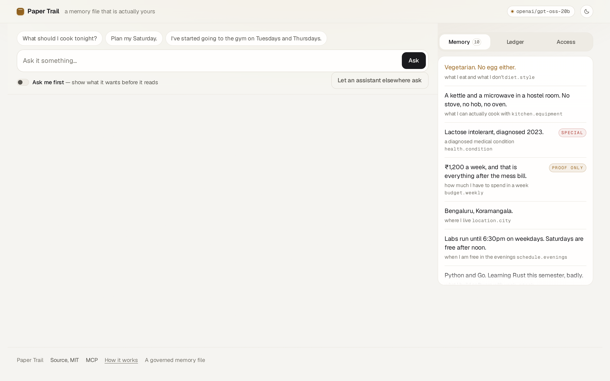
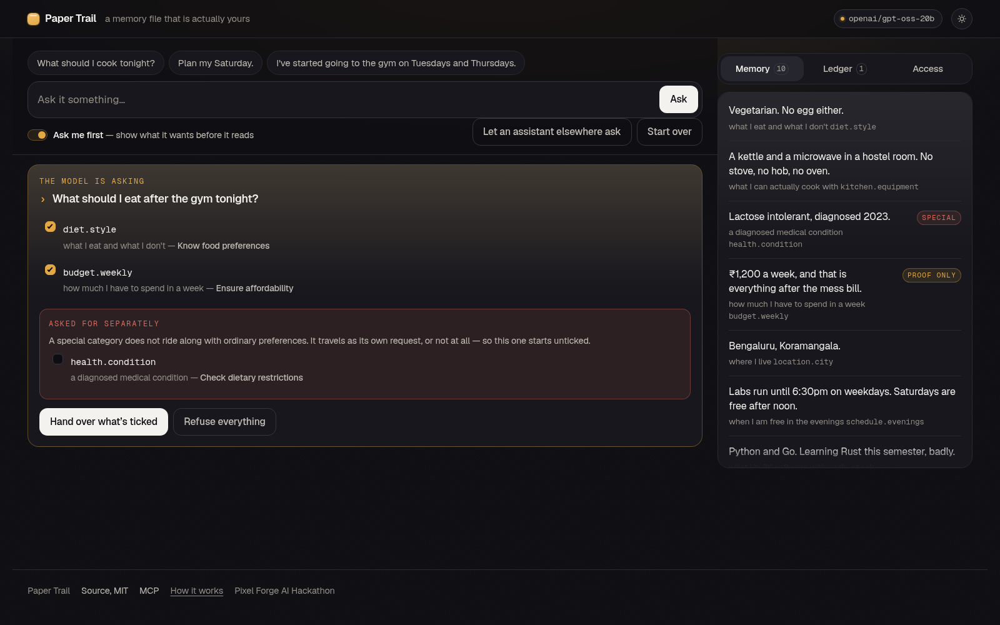
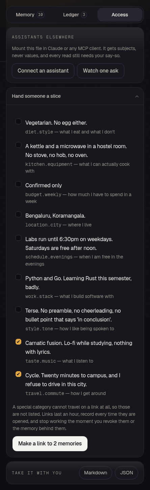

# Paper Trail

**A memory file that is actually yours.**

[](https://github.com/opx0/paper-trail/actions/workflows/ci.yml)

Paste anything about yourself and you have a governed memory file in under a minute. Ask it
anything and every answer is stamped with the exact memories the model was handed. Pull one
off and the question is answered again without it. Nothing is read without a receipt, nothing
is remembered without being asked, and it plugs into Claude over MCP with the same rules.

**Live: [trail.opxz.dev](https://trail.opxz.dev)** — no sign-up, no key, nothing to install.



The agent-facing surface is documented in [docs/MCP.md](docs/MCP.md).

| | |
|---|---|
|  |  |
| Five sentences become candidate memories. Nothing is kept until you tick it. | Pull a memory off the stamp row and the question is answered again without it. |
|  |  |
| Consent before the read. The special category sits apart, unticked. | A link over a subset, counted every time it is opened. |

---

## The gap this sits in

The 2026 AI-memory field — [Mem0, Zep, Letta](https://datapace.ai/blog/ai-agent-memory-tools-2026),
MemPalace and the rest — is developer infrastructure optimising for *agents remembering better*.
Every one is a service an application buys. Not one is accountable to the person being remembered.

> They make agents remember. Paper Trail makes remembering answerable to the person it is about.

Every assistant with a memory feature has the same three holes in it. You cannot see *why* it
said what it said. You cannot remove one thing it knows without wiping all of it. And you never
agreed to any of what it decided to keep.

---

## The claim, and why you should not take my word for it

Plenty of projects answer the first hole by asking the model which facts it used and printing
the reply. That is the model's account of itself: unverifiable, and wrong often enough to matter.

> **The receipt is written by the code that hands the value over, not claimed by the model
> afterwards.** The model cannot see a memory that was never placed in its prompt, and the
> stamps under an answer are rendered from rows written in the same database transaction as
> the read.

That is testable rather than promised, so it is tested:
[`test_scope_prompt_never_contains_a_memory_value`](tests/test_papertrail.py),
[`test_attested_memory_yields_proof_and_never_its_value`](tests/test_papertrail.py),
[`test_a_read_that_cannot_be_stamped_does_not_happen`](tests/test_papertrail.py).

---

## What it does

### Bring anything, get a memory file

Paste a bio, a résumé, an export from another assistant, or three sentences. One model call
proposes candidate memories, each classified as a special category or an attested figure, and
**nothing is written until you tick it**. Policy re-checks every flag rather than trusting the
model: an imported health fact still cannot ride along with dinner preferences, and an imported
salary still projects as proof rather than a number.

### Every answer says what it cost

A turn is two model calls. The first sees only what each memory is *about* — "a diagnosed
medical condition", never "coeliac" — and has to say which it needs and why. Only then is
anything projected and handed over. One call given every memory would already hold every memory,
and no stamp under the answer could mean anything.

Stamps arrive at about 0.6s, before the answer starts streaming, so you see what it was given
and then watch it work from precisely that.

### Pull a memory off and watch the answer change

The demo persona lives in a hostel with a kettle and a microwave. Ask what to cook and you get
microwave khichdi. Pull `kitchen.equipment` off the stamp row and the same question comes back
telling him to soften an onion in a pan. He has no pan.

### Be asked first, and grant a special category on purpose

Tick **ask me first** and a question stops after the scope call: the request appears as a card,
each memory with the reason given, nothing yet out of the database. The special category sits in
its own block, unticked. Grant it deliberately and it becomes a second independent request,
stamped `sensitive_read` apart from everything beside it.

### Hand someone a slice, or take the whole thing with you

A share link covers a **subset**, expires in an hour, records every time it is opened, and dies
the moment you revoke it. The rule on a link is stricter than the rule on a request: a special
category cannot travel on one at all, and an attested value never enters the payload. Export
gives you the whole file and its ledger as JSON or Markdown.

### The governance follows you into other assistants

Mount the file in Claude or any MCP client. `describe` shows subjects and never values.
`request_context` returns projected values for whatever a standing grant covers and a pending
request for everything else. `propose_memory` offers a memory and never writes one.

Standing grants exist because consent that interrupts a person on every call is consent they
will switch off. Answering a request can leave a grant behind — for the session, or for one read
— and the grant is listed, counted, and revocable. Revoke it and the next call is pending again.

---

## Start reading here

Six pure functions carry the whole model, in [`policy.py`](src/papertrail/policy.py):

| Function | What it guarantees |
|---|---|
| `labels_for_scope` | the scoping call is shown what a memory is about, never what it holds |
| `validate_request` | unknown, revoked, and ride-along special categories are all refused |
| `split_by_category` | a special category becomes its own request rather than a dead end |
| `authorize_share` | a link carries live, ordinary memories only |
| `project` | the only route a value takes to a model; attested yields proof, never value |
| `stamps` | the row under an answer is built from what was handed over, not what was claimed |

Everything else is thin. [`llm.py`](src/papertrail/llm.py) and
[`extract.py`](src/papertrail/extract.py) ask and parse and decide nothing.
[`turn.py`](src/papertrail/turn.py) is the only module that knows the order of the steps, split
into `propose` and `answer` so there is a moment where nothing has been handed over yet and a
person can still say no. [`store.py`](src/papertrail/store.py) is the only module that speaks
SQL, and every read and write puts its receipt down in the same transaction as the effect.
[`mcp.py`](src/papertrail/mcp.py) and [`app.py`](src/papertrail/app.py) hold no rules at all.

Every row is keyed by session, which is what makes an unauthenticated public demo of a
revocation feature possible: your revoke cannot change what the next visitor sees.

---

## Built with

React 19, Vite and TypeScript under `strict` with `noUncheckedIndexedAccess` and
`exactOptionalPropertyTypes`; a `useReducer` and no state library. FastAPI, SQLite and
`openai/gpt-oss-20b` on Groq at `reasoning_effort: low`, chosen by measurement:

| Model | Scope call | Result |
|---|---|---|
| `openai/gpt-oss-20b` | 0.64s | clean JSON, asks for six memories including the special category |
| `openai/gpt-oss-120b` | 0.53s | clean JSON, asks for two — a thinner, less honest stamp row |
| `qwen/qwen3.6-27b` | 1.27s | leaks `<think>` blocks, spends the budget reasoning |
| `groq/compound-mini` | 1.23s | clean JSON, four memories |

Any OpenAI-compatible endpoint works; set `PAPERTRAIL_BASE_URL` and `PAPERTRAIL_MODEL`. If the
upstream is unreachable the app serves clearly labelled stand-in answers, and every mechanic
still runs for real against them — the scoping, the refusals, the receipts, the revocation and
the proposals are all local.

---

## Run it

```bash
uv sync --all-extras
echo 'PAPERTRAIL_API_KEY=your-groq-key' > .env    # optional; without it, cached answers
uv run papertrail-serve                            # api on 8790

cd web && npm install && npm run dev               # interface on 5173, proxying the api
```

```bash
make all                        # ruff format check, ruff, mypy strict, pytest
LIVE=1 uv run pytest -m live    # the one test that really calls the model
make web                        # prettier check, tsc, vitest, vite build
```

60 Python tests and 19 TypeScript ones, written as the specification: one per property, named so
a failure explains itself.

Hosted as one systemd unit on loopback with a reverse proxy serving `web/dist` directly and
passing `/api/*` and `/mcp/*` through. Sessions and everything they hold are purged after
24 hours, because visitors paste personal text into this and there are no accounts.

---

## Provenance

Built independently in August 2026.

The policy and receipt engine is adapted from **Agent Visa**, my own MIT-licensed project —
`project()`, `validate_request()`, the same-transaction receipt discipline, and the visual
language. Everything else here was written for Paper Trail; this note is here so nobody has to
take that on trust.

Not built: accounts. Every visitor gets their own session and it is deleted within a day.

## What I would build next

Conflict detection, so a new memory that contradicts an old one is surfaced rather than
appended beside it — the failure mode of every memory system that only ever adds.

## License

MIT, see [LICENSE](LICENSE).
